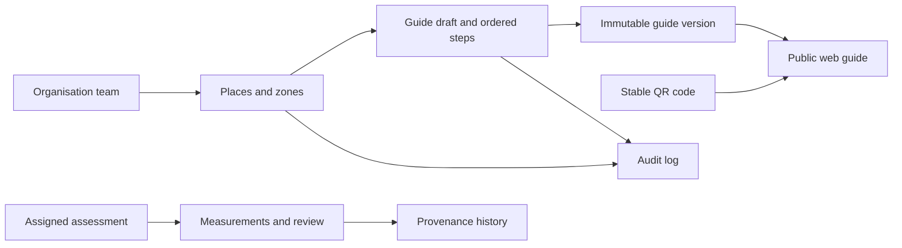

# Architecture

The application uses Next.js 16.4.0 App Router, React 19.3.0 and strict TypeScript. Package versions are pinned and the lockfile is committed. Plain CSS defines tokens, responsive layouts and reading modes. Public pages render on the server; client code handles navigation, preferences, guide interaction, catalog filters, the contact helper, the local/online builders and interactive account forms.

## Routes and language

`/` redirects to `/en`. A dynamic locale root layout validates EN/RO/DE, sets `<html lang>`, and shares navigation/footer. The language selector preserves the current route and never infers language from country. Public guide reading requires no account. Unknown places, QR codes and unsupported paths return 404.

- `src/lib/i18n.ts`: public and workspace UI dictionaries.
- `src/lib/content.ts`: public explanatory and legal draft copy.
- `src/lib/demo.ts`: typed fictional guide, sensory model and validated local draft schema.
- `src/lib/database.types.ts`: manually maintained foundation row contracts; replace with schema-generated types when management access to the new project is available.
- `src/lib/roles.ts`: organisation-role descriptions.

## Current data flows

Visitor → public guide → typed fictional data → one zone at a time. No database or personal profile is involved.

Editor → demo builder → versioned localStorage key scoped by locale → explicit Save → local preview. The public example continues to use the original typed guide. Invalid, incompatible or inaccessible browser storage falls back to the example.

Verified organisation user → `/[locale]/workspace` → tenant-scoped reads → server action → invoker `save_place_draft` RPC → atomic PostgreSQL save with a global revision check → private saved-draft preview. Cookie sessions are server-validated and refreshed in routing middleware. A stale save returns a conflict without replacing the client’s unsaved draft.

Zone photo → browser raster WebP → authenticated Node.js API → server Sharp decode/re-encode → immutable private Storage key → explicit draft save to attach metadata. Downloads go through an authenticated same-origin proxy with private/no-store caching. No public signed image URL is issued. Original files are not retained; processed private files are retained when detached.

Contact → validated browser form → prepared text / clipboard. No outbound message or database persistence.

QR download → server-side SVG generator → same-origin stable `/q/willow-museum?locale=...` → validated locale → public guide. Unknown codes return 404. The QR registry table is ready for a later database-backed implementation.

## Live design prepared in SQL

Tenant relationships are constrained by composite foreign keys. Public readers can access published guide metadata and the current immutable snapshot, not mutable zone tables or assessment records. The first live publish service must build snapshots from validated structured data in a single transaction. Verified labels remain unavailable until the evidence, review and expiry workflow is implemented.

## Accessibility and performance

Semantic HTML, a skip link, labelled controls, visible focus, focus movement on guide navigation, text-based sensory labels and reflow underpin the UI. Dark/high-contrast settings are optional preferences. No autoplay, automatically opened panels, marketing trackers or essential motion is present. A single fixed launcher opens a native nonmodal reading popup. The launcher is docked to the left screen edge and vertically centered; the popup opens beside it and stays fixed during page scroll. Background scroll and keyboard access remain usable. Escape/close return focus; outside-click close preserves clicked-control focus. Dragging, single-click nudge buttons and keyboard movement provide position adjustment, with viewport clamping. Preferences retain the existing browser-local key. Public/demo guides offer step-by-step and complete text views; all essential instructions, progress and messages are written on screen. WCAG 2.2 AA is a target, not an audited compliance claim.

Illustrations are local SVGs, so the site needs no third-party image or font service. Static page generation covers the public content and dashboard scaffold. QR generation and stable redirects use the default Node.js runtime. Preview indexing is disabled until real content and legal details are ready.

## Organisation follow-up

Local zone images use IndexedDB blobs with UUID references in language-scoped drafts. Image decoding and raster re-encoding remove original metadata. Local publication review records the exact saved draft, a representative, check date and statement version; it does not publish content.

Supabase SSR registration, confirmation, account access and controlled first-owner onboarding use the dedicated project `uzlngrzokjzxvdfpctnt` in the VIANORAE preview. The owner confirmed real signup and organisation creation. Without the matching dedicated URL/ref/publishable key, account forms stay disabled. User metadata only prefills profile data and never authorises access. See `ORGANISATION-FLOW.md` for session/tenant verification and the the private online workspace and remaining publication work.

Optional narration uses the browser Web Speech API with language-matched device voices and bounded utterances. Page reading extracts semantic main content while excluding controls and input values; guide/online previews receive their actual text and photo descriptions. One reader cancels another through a browser-local event. Step/language changes, panel close and component unmount cancel owned speech; generation checks ignore stale callbacks. No app TTS endpoint, generated audio storage or schema change is involved. The reading control floats independently of page layout; it consumes no image column.
