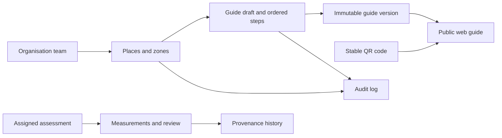

# Architecture

The application uses Next.js 16.4.0 App Router, React 19.3.0 and strict TypeScript. Package versions are pinned and the lockfile is committed. Plain CSS defines tokens, responsive layouts and reading modes. Public pages render on the server; client code is limited to navigation, preferences, guide interaction, catalog filters, the contact helper and the local builder.

## Routes and language

`/` redirects to `/en`. A dynamic locale root layout validates EN/RO/DE, sets `<html lang>`, and shares navigation/footer. The language selector preserves the current route and never infers language from country. Public guide reading requires no account. Unknown places, QR codes and unsupported paths return 404.

- `src/lib/i18n.ts`: public and workspace UI dictionaries.
- `src/lib/content.ts`: public explanatory and legal draft copy.
- `src/lib/demo.ts`: typed fictional guide, sensory model and validated local draft schema.
- `src/lib/database.types.ts`: manually maintained foundation row contracts; replace with schema-generated types when a new live Supabase project exists.
- `src/lib/roles.ts`: organisation-role descriptions.

## Current data flows

Visitor → public guide → typed fictional data → one zone at a time. No database or personal profile is involved.

Editor → demo builder → versioned localStorage key scoped by locale → explicit Save → local preview. The public example continues to use the original typed guide. Invalid, incompatible or inaccessible browser storage falls back to the example.

Contact → validated browser form → prepared text / clipboard. No outbound message or database persistence.

QR download → server-side SVG generator → same-origin stable `/q/willow-museum?locale=...` → validated locale → public guide. Unknown codes return 404. The QR registry table is ready for a later database-backed implementation.

## Live design prepared in SQL

Tenant relationships are constrained by composite foreign keys. Public readers can access published guide metadata and the current immutable snapshot, not mutable zone tables or assessment records. The first live publish service must build snapshots from validated structured data in a single transaction. Verified labels remain unavailable until the evidence, review and expiry workflow is implemented.

## Accessibility and performance

Semantic HTML, a skip link, labelled controls, visible focus, focus movement on guide navigation, text-based sensory labels and reflow underpin the UI. Dark/high-contrast settings are optional preferences. No autoplay, pop-ups, marketing trackers or essential motion is present. WCAG 2.2 AA is a target, not an audited compliance claim.

Illustrations are local SVGs, so the site needs no third-party image or font service. Static page generation covers the public content and dashboard scaffold. QR generation and stable redirects use the default Node.js runtime. Preview indexing is disabled until real content and legal details are ready.
